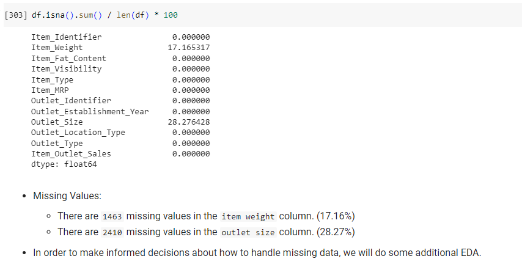
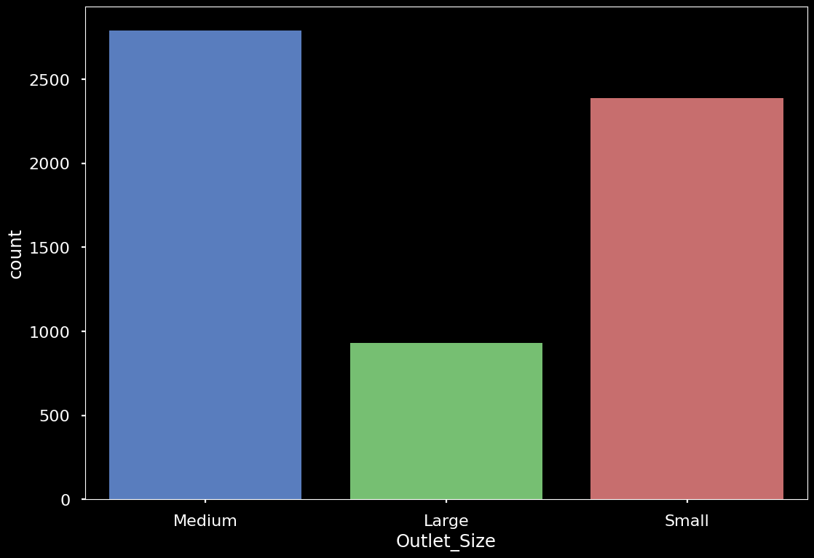
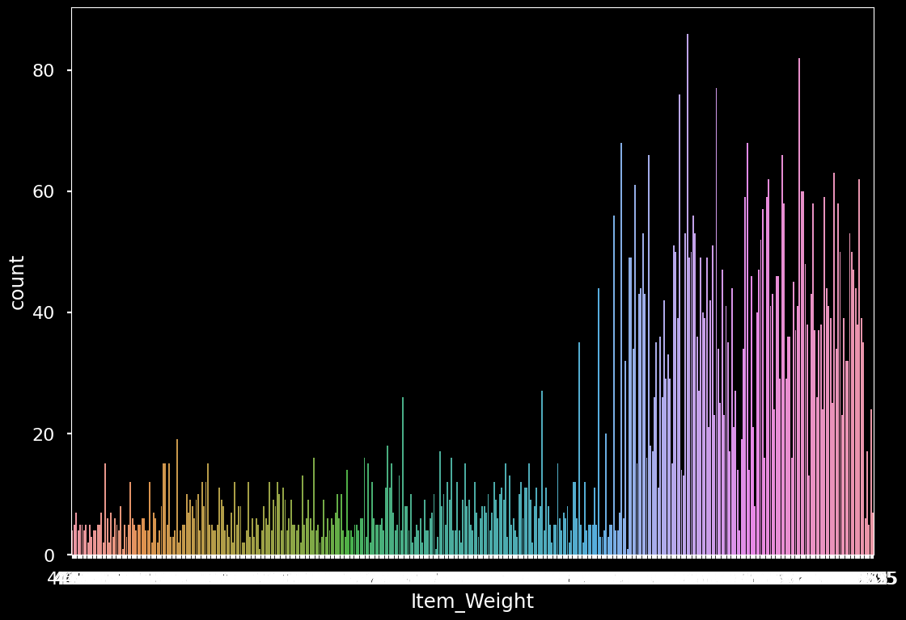

# Prediction of Sales
We've been hired by a food retail company to determine which products based on features like store, type and price would be able to predict increases in sales. We should be able to give them data-driven recommendations on how to best increase the sales at their stores.

We will be following the CRISP-DM workflow for our analysis.  

<a href="https://www.datascience-pm.com/crisp-dm-2">Image Source</a>

## Table of Contents

- [Phase 1) Business Understanding](#phase1)
- [Phase 2) Data Understanding](#phase2)
- [Phase 3) Evaluation](#phase3)

___

# Phase 1) Business Understanding

**Our stakeholders are:**
- Retail store owners

**Their primary goal is:**
- Increase the sales per store

**They plan to:**
- Move and stock specific goods to increase sale

**What do they need/expect?**
- Actionable insights/recommendations for which modifications they can make to increase the amount of sales per store.

___

# Phase 2) Data Understanding

## 2.1) What data have we been provided?

The stakeholders have provided us with a data set that contains sales predictions:

## 2.2) What information is included in the data?

- The file had 8523 rows and 12 columns.
- There is a mixture of datatypes:
  - 4 float
  - 1 int
  - 7 object
- Since numeric features are sometimes stored as object dtype, we will inspect the object columns next and look for columns that should be converted.

- **Object columns that needed to be removed:**
  - [ ] Outlet_establishment_year - will not influence sales
  - [ ] Outlet_identifier - will not influence sales

  
### **What is the meaning of each feature?**

Variable Name Description 
Item_Identifier: Product ID 
Item_Weight: Weight of product 
Item_Fat_Content: Whether the product is low-fat or regular 
Item_Visibility: The percentage of total display area of all products in a store allocated to the particular product 
Item_Type: The category to which the product belongs 
Item_MRP: Maximum Retail Price (list price) of the product Outlet_Identifier Store ID 
Outlet_Establishment_Year: The year in which store was established 
Outlet_Size: The size of the store in terms of ground area covered 
Outlet_Location_Type: The type of area in which the store is located 
Outlet_Typ:e Whether the outlet is a grocery store or some sort of supermarket 
Item_Outlet_Sales: Sales of the product in the particular store. This is the target variable to be predicted. 

## **2.3) How clean is the data?**

### Are there missing values?

Of these columns, 2 seem to have primarily null values ("Item Weight" and "Outlet Size"). 

#### Null Value Observations:
- "Item Weight" and "Outlet Size" have a low percentage of null values (17% and 28%, respectively).
- You can impute the values with median but the Outlet Size should have no influence on sales.
- Item Weight and Outlet Size would have an influence on sales.
  
### Are there duplicate rows?

- No Duplicates

### Are there any features with inconsistent values? (“yes” vs. “Yes”)
- No

#### Categorical Features
**Outlet Size**: 

Shows the sale distribution based on the size of the outlet

#### Numeric Features

Shows the  distribution of weight per item

___

# Phase 3) Evaluation
 
The Larger Outlet size sales are low, therefore one recommendation is to improve the footprint of the medium size stores and reduce the large size stores to increase sales. 
Heavier items are sold more, therefore review the product list and focus on the heavier items to increase sales. Though there may be a cost implication in terms of transporting and storing heavier items. This will need to be evaluated as well.
